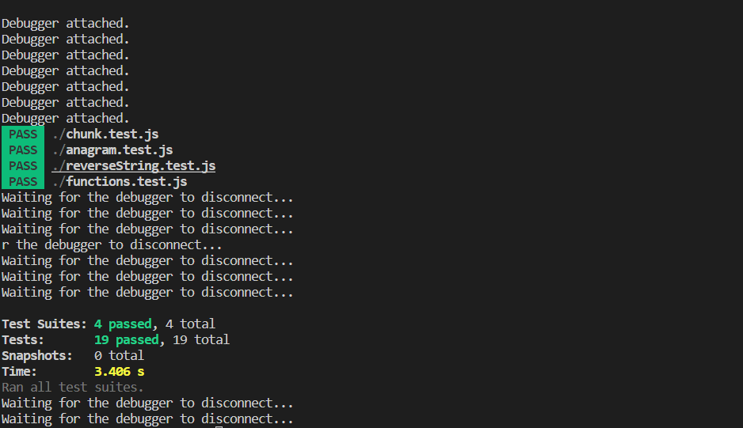

# Learning Testing Jest

##### [JEST. Docs](https://jestjs.io/docs/getting-started)
##### [Jest Crash Course - Unit Testing in JavaScript](https://www.youtube.com/watch?v=7r4xVDI2vho&t=565s)
##### [What are Unit Testing, Integration Testing and Functional Testing?](https://codeutopia.net/blog/2015/04/11/what-are-unit-testing-integration-testing-and-functional-testing/)
##### [BDD vs TDD vs ATDD : Key Differences](https://www.browserstack.com/guide/tdd-vs-bdd-vs-atdd)